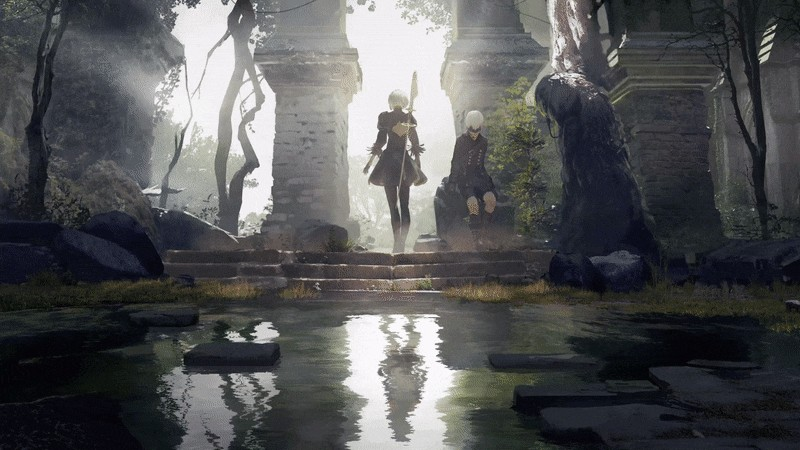
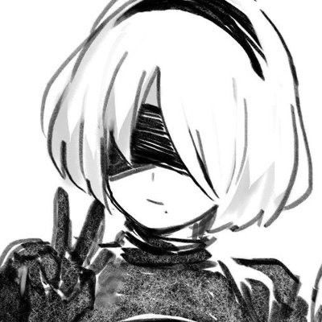
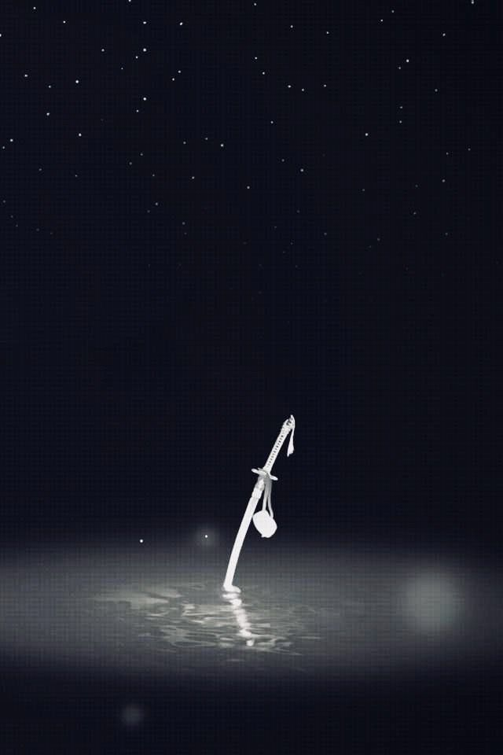
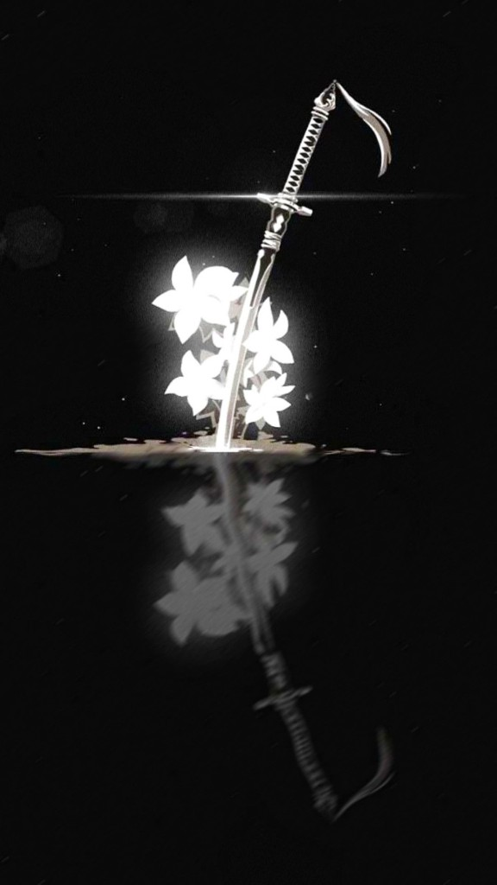
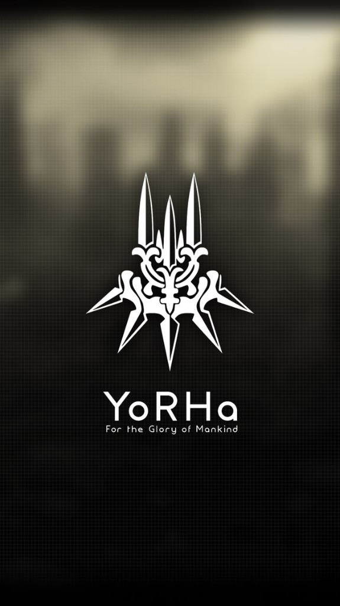
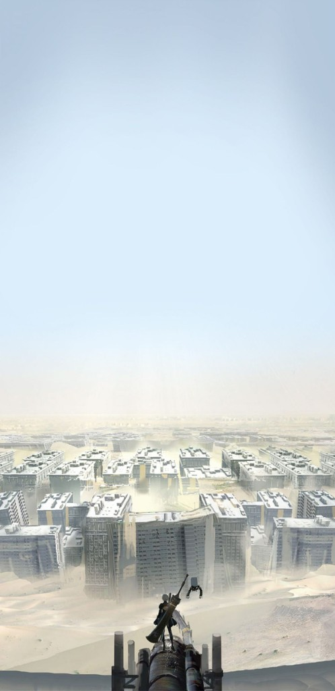
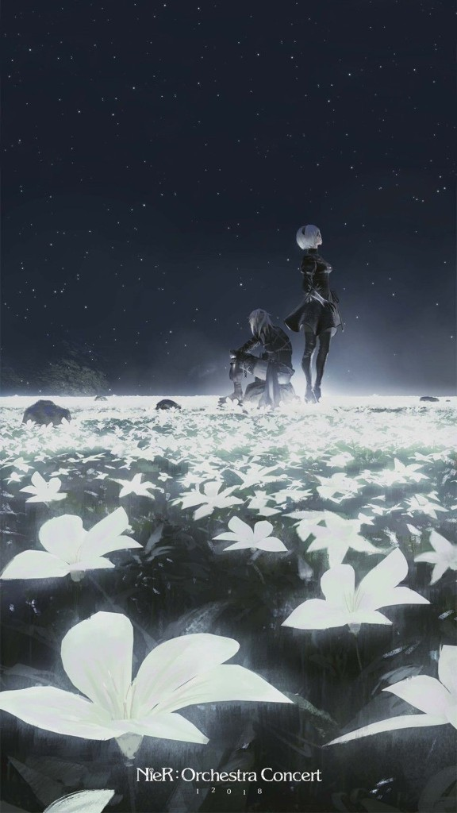
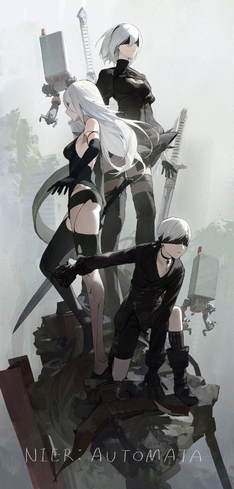
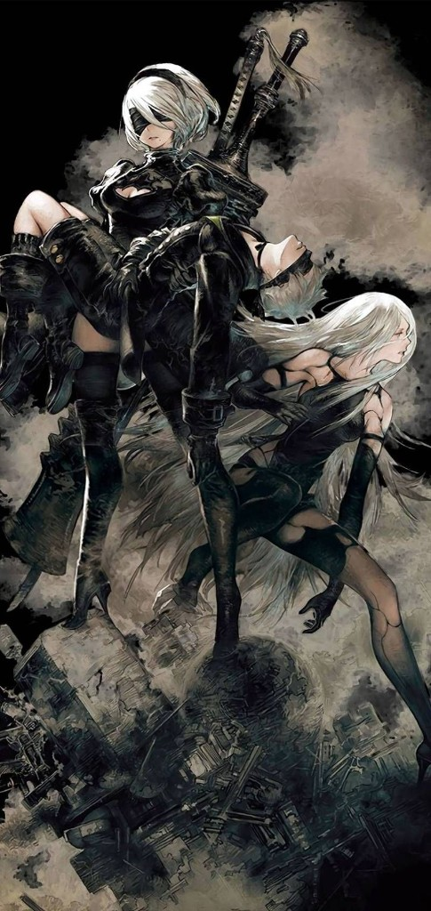

<div align="center">

<!-- Banner: 2B & 9S — ruins (animation nếu file gốc là GIF) -->


<br/>

<sub><code style="color:#a8a29e">「 This cannot continue… unless we ship. 」</code></sub>

</div>

<br/>

<table>
<tr>
<td width="42%" valign="top">

### ◆ STATUS REPORT

<table width="100%"><tr>
<td valign="top">

```
UNIT: longnhx1
ROLE: Developer
STATE: [ OPERATIONAL ]
```

Mình thích code sạch, UI có hồn, và những project “có chút điên” giống NieR — không chỉ chạy được mà còn kể được chuyện.

</td>
<td valign="top" width="128"></td>
</tr></table>

</td>
<td width="58%" valign="top">

### ◆ LOADOUT

<p align="center">
  
  
  
  <br/>
  
  
  
</p>

*Chỉnh badge cho đúng stack của bạn.*

</td>
</tr>
</table>

<br/>

### ◆ FIELD RECORD

<table width="100%">
<tr>
<td width="34%" valign="top" align="center"></td>
<td width="33%" valign="top" align="center"></td>
<td width="33%" valign="top" align="center"></td>
</tr>
</table>

<br/>

<table>
<tr>
<td width="50%" valign="top" align="center">

**Copied City**



</td>
<td width="50%" valign="top" align="center">

**Lunar Tears / Orchestra**



</td>
</tr>
</table>

<br/>

<table>
<tr>
<td width="50%" valign="top" align="center">

**Cast**



</td>
<td width="50%" valign="top" align="center">

**Key art**



</td>
</tr>
</table>

<br/>

<div align="center">

### ◆ COMBAT ANALYTICS


<br/>


</div>

<br/>

<details>
<summary><strong>◆ ARCHIVE // CONTACT</strong></summary>

<br/>

<div align="center">

| Channel | Link |
|:--------|:-----|
| GitHub | [@longnhx1](https://github.com/longnhx1) |
| *Thêm* | *Email / LinkedIn / Discord — sửa bảng này* |

</div>

</details>

<br/>

<div align="center">

```
─────── For the Glory of Mankind ───────
```

<sub>NieR: Automata–inspired profile · Ảnh trong <code>assets/</code></sub>

</div>
